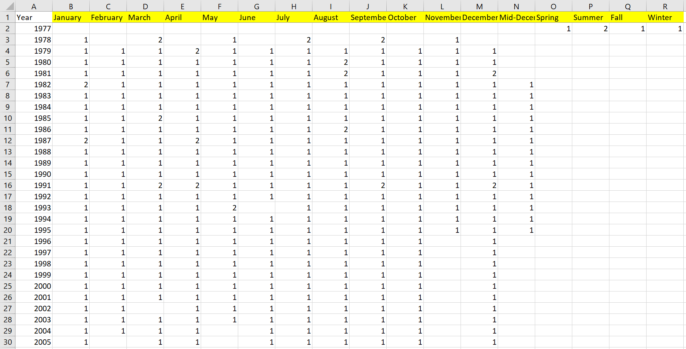
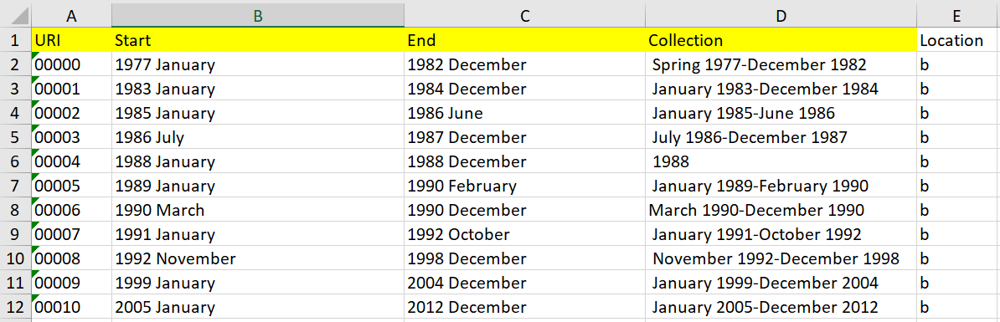
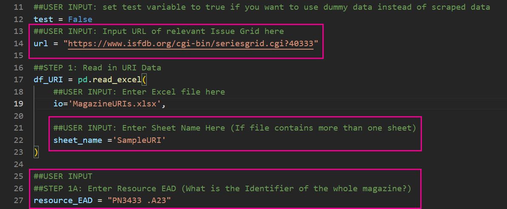
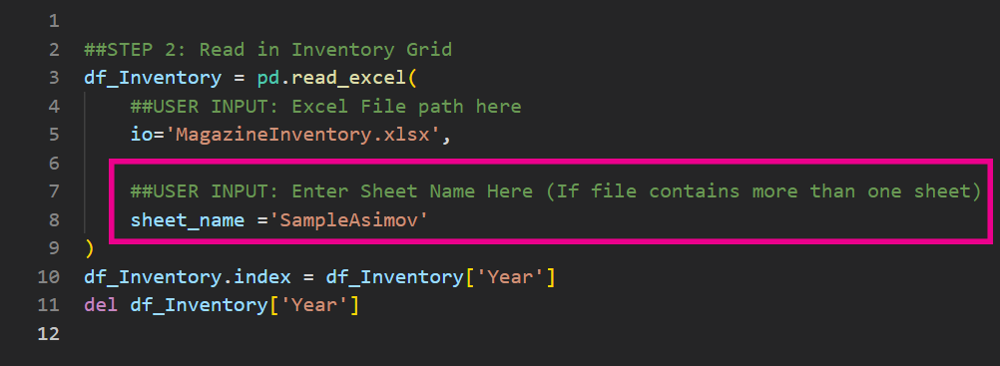
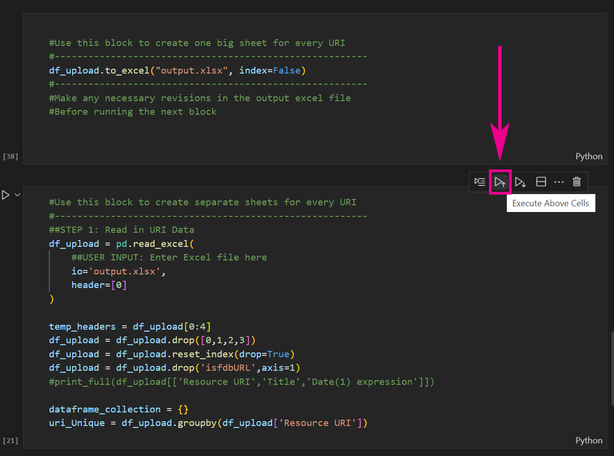
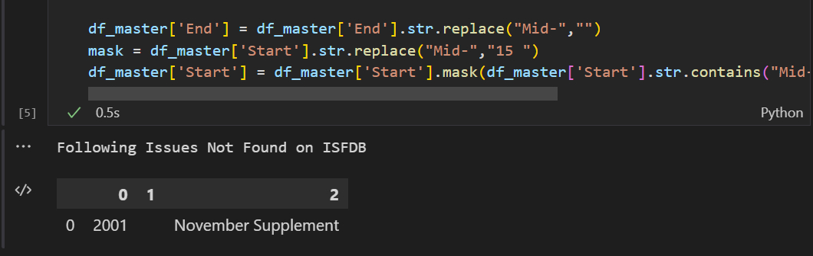
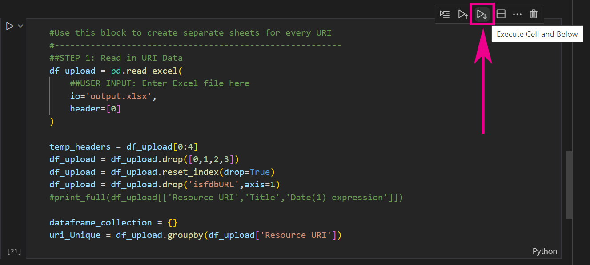
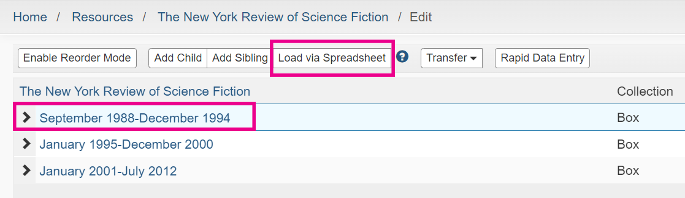

# Automated Science Fiction Magazine Inventory for ArchivesSpace
> This project takes in basic inventory information regarding
>science fiction magazines, enriches it, and outputs it in 
>in a ready-to-upload format for ArchivesSpace.

## Table of Contents
* [General Info](#general-information)
* [Technologies Used](#technologies-used)
* [Features](#features)
* [Setup](#setup)
* [Usage](#usage)
* [Project Status](#project-status)
* [License](#license) 

## General Information
- Significantly reduces the time required to add new volume data to existing box data in ArchivesSpace resources.
- Enriches inventory information with <b>issue and volume data</b> from the [__Internet Speculative Fiction Database__](https://www.isfdb.org/) under the [__Creative Commons License
version 4.0__](https://isfdb.org/wiki/index.php/Creative_Commons_License).
- Developed by Olivia Kiklica for the [__Science Fiction Archives at the Georgia Institute of Technology.__](https://www.library.gatech.edu/scifi-lounge)

## Technologies Used
- Anaconda 3, includes:
    - Jupyter Notebooks
    - Python - version 3.9.12
    - pandas - version 1.4.4
- Microsoft Excel
- ArchivesSpace

## Features
- Takes .xlsx sheets of inventory and matches inventory to existing data on ISFDB.
- Enriches barebones inventory data with issue/volume data.
- Presents data for manual review before final output.
- Automatically assigns all input volumes into individual sheets corresponding with the appropriate, existing box on ArchivesSpace.
- Output sheets are ready for upload to ArchivesSpace; no further user manipulation necessary.

## Setup
What are the project requirements/dependencies? Where are they listed? A requirements.txt or a Pipfile.lock file perhaps? Where is it located?

Proceed to describe how to install / setup one's local environment / get started with the project.

## Usage
>### 1. Inventory Input
In MagazineInventory.xlsx, create a new sheet for the volumes currently being worked on, in the same format as the SampleAsimov sheet. Populate each cell with the number of items in inventory.

<b>Note:</b> If the magazine is for multiple months (e.g, January/February), mark the first month as being in inventory and leave the second blank. For example, if you had a magazine for June/July of 1987, mark 1 in June 1987, and leave July blank.

>### 2. Preparing URIs
Create a new sheet in MagazineURIs.xlsx.

<b>The sheet must contain the following columns:</b>
- <b>URI</b> - Pulled from the ArchivesSpace URL (can also be obtained via API script).
- <b>Start</b> - In Year Month format.
- <b> End </b> - In Year Month format.
- <b>Collection</b> - Name of the Collection (any text).

Other columns can be added for sorting purposes, but only the above will be read by the script.

<b>Note:</b><i> There should not be any overlap in timeframes between collections. If one set of boxes is held onsite and another offsite, run them with separate sheets to prevent overlap.</i>

>### 3. Setting Up the Script

Open interpretation_script.ipynb in VSCode (or editor of your choice).

>#### First Cell Block
There are five potential user inputs in the first cell block. Generally you will only need to modify three.
1. <b>url</b> (line 14) - Input the ISFDB link of the issue grid. [__The page looks like this.__](https://www.isfdb.org/cgi-bin/seriesgrid.cgi?40333)
2. <b>sheet_name</b> (line 22) - Input the relevant sheet name containing the URIs.
3. <b>resource_EAD</b> (line 27) - Input the resource EAD from ArchivesSpace.

>#### Second Cell Block
Input the sheet name of the inventory input (line 8 of the second cell block).

>### 4. Running the Script (Part 1)

>### 5. Making Desired Corrections
Open the output sheet (by default, this is output.xlsx).
Corrections to data can be made manually here before final output.

If any issues in the Excel sheet were not found on ISFDB, they will be shown below the fourth cell block.

If you are sure the issue exists, it can be added manually in the output sheet.

Humans are fallable: even data pulled perfectly from ISFDB can contain typos, illegible information, or lack information entirely.

Tips:
- Use CTRL+F to find and replace recurring errors.
- If using CTRL+F to replace Roman numerals with Arabic numerals, <b> work backwards </b> from most recent to least. Otherwise you run the risk of replacing numerals incorrectly (e.g, the string 'XVII' is also found in the numeral 'XVIII').
- If data is missing, click on the URL to look for it. If not present on ISFDB, you may need to consult the physical issue (or find a scan of the issue on the [__Internet Archive__](https://archive.org/)).

>### 6. Running the Script (Part 2)
Click the 'Execute Cell and Below' button in the eighth block.
If you changed the name of the output sheet in the seventh block, be sure to update it here.

Results will appear in the 'xlsx_output' folder.

>### 7. Upload to ArchivesSpace
1. Navigate to the resource in ArchivesSpace.
2. Select the appropriate box.
3. Select 'Load via Spreadsheet.'
4. Navigate to 'xlsx_output' and select the appropriate spreadsheet.

## FAQ
- Q: Why is the final output multiple sheets, instead of one large sheet?
    - A: Each spreadsheet represents one parent box. This is due to idiosyncrasies in the ArchivesSpace bulk upload API. When <i>updating existing resources</i> (in this case, individual boxes), the contents of the bulk upload spreadsheet must all belong to the same parent (i.e, must have the same URI).

- Q: What if I'm creating new parent boxes <i> and </i> their child volumes at the same time?
    - A: Theoretically this can be done in bulk without the need for a separate spreadsheet for each box, as long as the boxes do not already exist in ArchivesSpace. Here are some barebones instructions, which will require knowledge of ArchivesSpace templates and some fiddling on your part:
        1. In Step 2, create dummy URIs.
        2. In Step 5, manually add the boxes into the spreadsheet and adjust the 'Hierarchical Relationship' column appropriately. Boxes and their children must be grouped consecutively.
            - Once complete, delete the URI column.
        3. Skip Step 6. 
        4. Upload to the parent resource, instead of the individual boxes, on ArchivesSpace.

- Q: How malleable is the input template for inventory?
    - A: Fairly. The script matches the Excel inventory sheet onto the individual cell contents of the ISFDB inventory. For Example: If a cell in the ISFDB inventory says "No Date", adding a 'No Date' column in row 1 of the Excel sheet will work.

## Project Status
Project is complete.

## License
This project is open source and available under the MIT License.

Copyright © 2022, Olivia Kiklica

Permission is hereby granted, free of charge, to any person obtaining a copy of this software and associated documentation files (the "Software"), to deal in the Software without restriction, including without limitation the rights to use, copy, modify, merge, publish, distribute, sublicense, and/or sell copies of the Software, and to permit persons to whom the Software is furnished to do so, subject to the following conditions:

The above copyright notice and this permission notice shall be included in all copies or substantial portions of the Software.

THE SOFTWARE IS PROVIDED "AS IS", WITHOUT WARRANTY OF ANY KIND, EXPRESS OR
IMPLIED, INCLUDING BUT NOT LIMITED TO THE WARRANTIES OF MERCHANTABILITY,
FITNESS FOR A PARTICULAR PURPOSE AND NONINFRINGEMENT. IN NO EVENT SHALL THE
AUTHORS OR COPYRIGHT HOLDERS BE LIABLE FOR ANY CLAIM, DAMAGES OR OTHER
LIABILITY, WHETHER IN AN ACTION OF CONTRACT, TORT OR OTHERWISE, ARISING FROM, OUT OF OR IN CONNECTION WITH THE SOFTWARE OR THE USE OR OTHER DEALINGS IN THE SOFTWARE.
